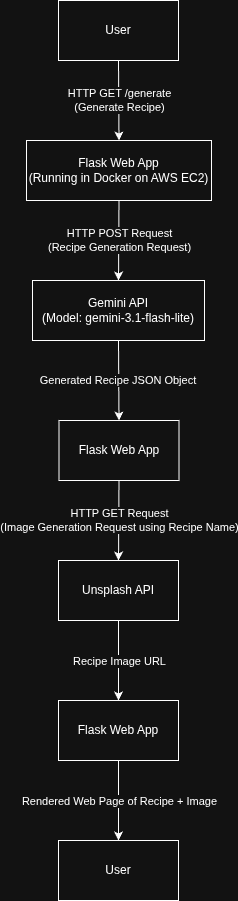

# Dinner-Decider Deep Dive

## Project Overview

Dinner-Decider is a cloud-hosted AI-powered web application that generates recipes based on user-selected cooking preferences or a random recipe option.

The application is built with Flask and runs inside a Docker container hosted on an AWS EC2 instance. Infrastructure is provisioned using Terraform, and deployments are automated through GitHub Actions CI/CD.

When a user submits their preferences, the Flask application sends a request to the Gemini API to generate a recipe. Once the recipe is generated, the application extracts the recipe name and sends a second request to the Unsplash API to retrieve a relevant image. The recipe and image are then rendered together and returned to the user through the web interface.

## Architecture

Infrastructure Diagram

Deployment Diagram

## Request Flow

1. User generates recipe request from preference inputs or random generation
2. Flask receives request
3. Gemini API called
4. Response returns recipe JSON
5. Unsplash API called
6. Image URL of recipe returned
7. Flask App renders recipe and image of recipe to User

## AWS Infrastructure
Provisioned via Terraform. This allows infrastructure to be repeatable, version-controlled, and recreated consistently across environments.

### EC2
Hosts the Docker container that runs Dinner-Decider Flask app.

### Security Groups
Controls network access to the EC2 Instance

## Docker

### Dockerfile

FROM python:3.12-slim 
— small, official Python runtime for predictable, minimal base image.

WORKDIR /app 
— sets working directory for builds and runtime.

COPY . . 
— copies application source into the image so the image is self-contained (immutable artifact).

RUN pip install -r requirements.txt 
— installs Python dependencies at build time (caching layer for faster rebuilds when source changes but requirements don't).

EXPOSE 5000 
— documents that the container listens on port 5000 (does not publish the port by itself).

CMD ["python", "app.py"] 
— launches the Flask app.

## GitHub Actions
After a push to main branch, 
1. Workflow checks out repo
2. SSH to EC2 Instance using secrets
3. Runs remote script to pull repo and rebuild docker image/container. 

## Terraform

main.tf

Provisions the AWS infrastructure needed to run Dinner-Decider:
- Configures AWS provider and region
- Creates security group allowing inbound HTTP, App port, and SSH
- Looks up latest Ubuntu AMI
- Launches EC2 instance and runs user-data to install Docker/nginx, clone repo, build image and start container
- Associates an Elastic IP to EC2 instance for stable public IP

variables.tf

Declares input variables for Terraform to use:
- AWS region
- EC2 Instance Type
- Github Repo
- Gemini API Key
- Unsplash API Key
- SSH CIDR

outputs.tf

Defines values Terraform will print/export after "terraform apply":
- EC2 Instance Public IP Address
- EC2 Instance Resource ID
- App URL
- Security Group ID

## Lessons Learned
Building Dinner-Decider gave me hands-on experience with several core DevOps concepts, including Infrastructure as Code, cloud hosting, containerization, CI/CD automation, and external API integrations. While developing the project, one of the biggest challenges was understanding how all of the components worked together as a complete system rather than as individual technologies.

Through Terraform, I learned the value of defining infrastructure as code to create repeatable and consistent environments. Using AWS EC2 allowed me to gain experience deploying and hosting an application in the cloud, while Docker simplified application deployment by packaging the application and its dependencies into a portable container. Implementing GitHub Actions helped me understand the fundamentals of CI/CD by automating deployments and reducing the manual effort required to release new code changes.

This project also introduced me to integrating AI services into a production application. By leveraging the Gemini API for recipe generation and the Unsplash API for image retrieval, I gained experience working with external services, API authentication, and application workflows that depend on multiple systems.

Perhaps the most valuable lesson was learning how the entire software delivery lifecycle fits together—from writing code and provisioning infrastructure to automating deployments and operating an application in the cloud. The project highlighted areas where I want to continue growing, particularly in security, reliability, and operational best practices.

Moving forward, I plan to enhance the project by implementing HTTPS, strengthening security group configurations, introducing automated testing, storing Terraform state remotely, and improving the application's resiliency and monitoring. These improvements will help transform the project from a functional application into a more production-ready platform.